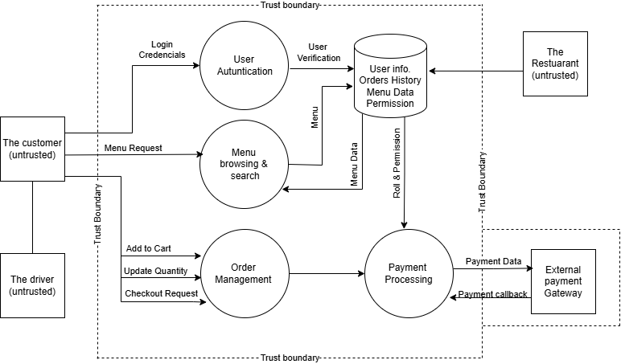

# Task B: Threat Modelling and Secure SDLC

   # B.1 System Overview

      This hypothetical system is a web-based food ordering platform that allows users to browse restaurant menus,add to cart, place orders, and make online payments.

   # B.2 Data Flow Diagram (DFD)

     

   # B.3 Key Features

    - User registration and login.
    - Browse menus and offers.
    - Add to the cart.
    - Place and track food orders.
    - Online payment processing.

   # B.4 User Roles

    - Customers.
    - Restaurant staff.
    - System administrators.
    - Delivery Driver.

   # B.5 STRIDE Analysis

    1. Spoofing

       * Threat: Someone pretends to be another user
             (Logging into someone else’s account)

       * Mitigation:

         - Multi-factor authentication.
         - Secure session management.
         - Strong password policies.

    2. Tampering

       * Threat: Changing data without permission
                 (Changing the price of an order)

       * Mitigation:

          - Validate all data on the server.
          - Do not trust user input.

     3. Repudiation

       * Threat: Users deny their actions
               (user claims he didn’t place an order)

       * Mitigation:

          - Keep logs of user activity.
          - Provide order confirmations.
         

     4. Information Disclosure

        * Threat: Private data is exposed
                 (Leaking user addresses or payment details)

        * Mitigation:

          - Use HTTPS.
          - Protect stored data.

     5. Denial of Service.

         * Threat: System becomes unavailable
                  (Too many requests crash the server)

         * Mitigation:

           - Limit requests (rate limiting)

          
     6. Elevation of Privilege

         * Threat: Gaining higher access rights
                  (A normal user becomes an admin)

         * Mitigation:

           - Use role-based access control

   # B.6 Security Requirements

           - Use secure login and password hashing.
           - Use HTTPS for all communication.
           - Validate all inputs.
           - Limit user permissions.
           - Keep logs of important actions.

   # Conclusion

       This portfolio demonstrates the importance of understanding software vulnerabilities at a fundamental level. The buffer overflow example highlights how insecure coding practices can lead to critical security flaws. By applying secure coding techniques, these risks can be mitigated effectively. The STRIDE threat model further illustrates how structured analysis can identify and reduce risks in system design.

       Overall, secure software development requires both technical implementation and systematic risk assessment.